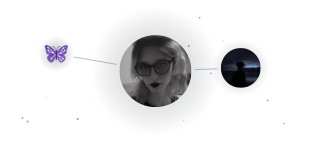
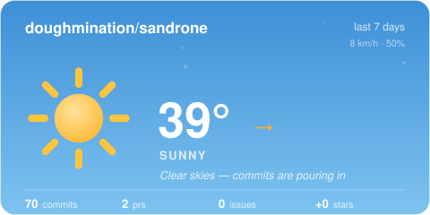

# Sandrone

  

### Status Badges

  
  
  

### About
This is a personal bot I'm using to relearn Python better than I originally did

I learned Python in the least accessible and most hated way possible, and I always struggled.

> [!NOTE]
> I AM USING AI, but in a way that I wish AI was intended to be used. As a tool! I am using it to help assist and give me pointers, it is not giving me solutions or generating code for me. All code is written by me, and pointers are being given to me are being provided via [Claude AI](https://claude.ai). I provide this for transparency in a dishonest world.
> Exception to this is a chore from ChatGPT and a typo Claude fixed.

### LICENSE

The bot, and all it's code, is licensed under DASL, please read the [License](./licence.md) for terms.

### Contributions

### Activity

